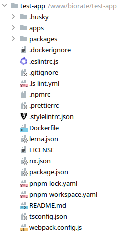
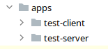
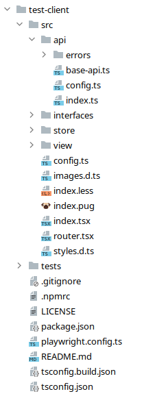
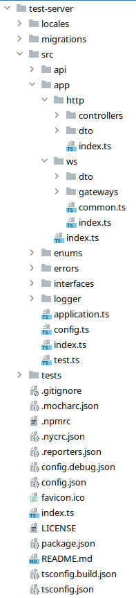

# Структура приложения

### Корень приложения:

- **.husky** - каталог pre-commit скриптов [husky](https://typicode.github.io/husky/).
- **apps** - каталог приложений входящих в состав моно-репозитория (клиент / сервер).
- **packages** - каталог общих пакетов моно-репозитория.
- **.dockerignore** - файл исключений при сборке docker-образа.
- **.eslintrc** - конфигурационный файл линтера [eslint](https://eslint.org/).
- **.gitignore** - файл исключений для git-репозитория.
- **.ls-lint.yml** - конфигурационный файл линтера [ls-lint](https://github.com/loeffel-io/ls-lint).
- **.npmrc** - конфигурационный файл пакетного менеджера (npm / pnpm).
- **.prettierrc** - конфигурационный файл [prettier](https://prettier.io/).
- **.stylelintrc.json** - конфигурационный файл линтера [stylelint](https://stylelint.io/).
- **Dockerfile** - docker-файл для сборки образа проекта.
- **lerna.json** - конфигурационный файл lerna для управления моно-репозиторием (установка зависимостей, версионирование).
- **LICENSE** - файл с описанием лицензии.
- **nx.json** - конфигурационный файл nx для управления моно-репозиторием. Входит в состав lerna.
- **package.json** - конфигурационный файл node.js приложения [package.json](https://docs.npmjs.com/creating-a-package-json-file). Содержит общие зависимости для клиента и сервера.
- **pnpm-lock.yaml** - lock-файл пакетного менеджера [pnpm](https://pnpm.io/).
- **pnpm-workspaces** - файл пакетного менеджера [pnpm](https://pnpm.io/), описывающий папки из которых состоит моно-репозиторий.
- **README.md** - файл содержащий описание проекта.
- **ts-config.json** - корневой конфигурационный файл [typescript](https://www.typescriptlang.org/).
- **webpack.config.js** - конфигурационный файл [webpack](https://webpack.js.org/), для описания правил сборки клиентского приложения.

### Папка apps:

В папке apps содержатся клиент-серверные приложения из которых состоит проект.
Моно-репозиторий может содержать как клиентские, так и серверные части проекта.
**Внимание!** В данный момент пайплайн не умеет работать более чем с одним клиент/сервером, что
планируется исправить в будущем.

### Структура клиентского приложения:

- **src** - основная папка приложения.
  - **api** - папка содержит классы для вызова внешнего api, см. [HTTP клиент](./AXIOS.md).
    - **errors** - папка содержит фабрику обработки ошибок для api запросов.
  - **store** - mobx-хранилище состояния.
  - **interfaces** - папка для хранения типов и интерфейсов.
  - **view** - react-view составляющая клиентского приложения. 
  - **config.ts** - root-конфиг клиентского приложения.
  - **images.d.ts** - файл декларации типов TypeScript для разрешения загрузки картинок.
  - **index.less** - корневой файл стилей.
  - **index.pug** - pug-шаблон для корневого html файла приложения.
  - **index.tsx** - точка входа.
  - **router.tsx** - роутер SPA приложения.
  - **styles.d.ts** - файл декларации типов TypeScript для разрешения загрузки стилей.
- **tests** - папка с playwright тестами.
- **.gitignore** - файл исключений для git-репозитория.
- **.npmrc** - конфигурационный файл пакетного менеджера (npm / pnpm).
- **LICENSE** - файл с описанием лицензии.
- **package.json** - клиентский конфигурационный файл node.js приложения [package.json](https://docs.npmjs.com/creating-a-package-json-file). Содержит только клиентские зависимости.
- **playwright.config.ts** - конфигурационный файл playwright тестов.
- **README.md** - файл содержащий описание клиентского приложения.
- **ts-config.build.json** - клиентский конфигурационный файл [typescript](https://www.typescriptlang.org/). Наследуется от корневого. Используется при production сборке. 
- **ts-config.json** - клиентский конфигурационный файл [typescript](https://www.typescriptlang.org/). Наследуется от корневого.

### Структура серверного приложения:

- **locales** - папка содержит локализацию приложения.
- **migrations** - папка с миграциями, см. [Миграции](./MIGRATIONS.md).
- **src** - основная папка приложения.
  - **api** - папка содержит классы для вызова внешнего api, см. [HTTP клиент](./AXIOS.md).
  - **app** - тут содержаться контроллеры nest.js.
    - **http** - http контроллеры + DTO [nest.js http controllers](https://docs.nestjs.com/controllers).
    - **ws** - ws контроллеры + DTO (если веб-сокеты были добавлены при генерации шаблона) [nest.js ws gateways](https://docs.nestjs.com/websockets/gateways).
  - **enums** - папка для Enum типов данных.
  - **errors** - папка для каталогизации ошибок, см. [Работа с ошибками](./ERRORS.md).
  - **interfaces** - папка для хранения типов и интерфейсов.
  - **logger** - переопределение обработчика логирования nest.js для соответствия стандарту логирования.
  - **application.ts** - сервис инициализации nest.js сервера. Настройка middlewares, interceptors, сборка swagger-а, инициализация сервера, CORS, proxy и т.д.
  - **config.ts** - root-конфиг серверного приложения.
  - **index.ts** - точка входа.
  - **test.ts** - Пример создания сервиса (присутствует, если не выбран параметр --cut-examples).
- **tests** - папка с mocha тестами.
- **.gitignore** - файл исключений для git-репозитория.
- **.mocharc** - конфигурационный файл [mocha](https://mochajs.org/).
- **.npmrc** - конфигурационный файл пакетного менеджера (npm / pnpm).
- **.nycrc.json** - конфигурационный файл [nyc](https://istanbul.js.org/).
- **.reporters.json** - конфигурационный файл построения тест-отчётов.
- **config.debug.json** - конфигурационный файл приложения запущенного в debug-окружении.
- **config.json** - общий конфигурационный файл приложения.
- **favicon.ico** - пиктограмма web-приложения.
- **index.ts** - точка входа.
- **LICENSE** - файл с описанием лицензии.
- **package.json** - серверный конфигурационный файл node.js приложения [package.json](https://docs.npmjs.com/creating-a-package-json-file). Содержит только серверные зависимости.
- **README.md** - файл содержащий описание серверного приложения.
- **ts-config.build.json** - серверный конфигурационный файл [typescript](https://www.typescriptlang.org/). Наследуется от корневого. Используется при production сборке. 
- **ts-config.json** - серверный конфигурационный файл [typescript](https://www.typescriptlang.org/). Наследуется от корневого.
