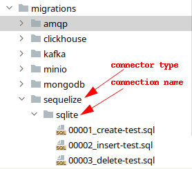

# Миграции

Для управления миграциями реализован пакет [@biorate/migrations](https://www.npmjs.com/package/@biorate/migrations).

### Поддерживаемые типы миграций:

- sequelize
- mongodb
- clickhouse
- minio
- kafka
- amqp

### Общий принцип:



- В корне серверного приложения должна быть создана папка **migrations**.
(Может быть переопределено через **migrations.directory** в конфиге приложения)
- Далее располагаются папки типов миграций.
- В папках типов миграций располагаются папки названные в соответствии с именем
соединения (папки миграций) через которое будут накатываться миграции. 
- Далее в папках миграций располагаются файлы миграций.

### Правила именования миграций:

XXXXX_ACTION-NAME.EXT

- XXXXX - номер миграции для правильного порядка накатывания миграций.
- ACTION - действие (create, insert, update, alter, и т.д.).
- NAME - описание или название (на пример имя таблицы).
- EXT - sql или js в зависимости от типа миграции.

### Пример sequelize миграций:

```sql
-- 00001_create-test.sql
CREATE TABLE test
(
  id INT PRIMARY KEY NOT NULL,
  title VARCHAR(255) NOT NULL
);
```

### Пример mongodb миграций:

```js
// 00001_create-index-test.js
module.exports = async (connection, config, globalConfig) =>
  await connection.collection('test').createIndex({ test: 1 });
```

### Пример minio миграций:

```js
// 00001_create-test-bucket.js
module.exports = async (connection, config, globalConfig) =>
  await connection.makeBucket('test-bucket', 'test-bucket');
```

### Пример kafka миграций:

```js
// 00001_create-test-topic.js
module.exports = async (connection, config, globalConfig) => {
  if (
    !(await connection.createTopics({
      topics: [{ topic: 'test-topic', numPartitions: 1 }],
    }))
  )
    throw new Error();
};
```

### Пример clickhouse миграций:

```sql
-- 00001_create-test.sql
CREATE TABLE test
(
  id UInt8
)
ENGINE = MergeTree()
PRIMARY KEY (id);
```

### Пример amqp миграций:

```js
// 00001_create-test-exchange.js
module.exports = async (channel, connection, config, globalConfig) => {
  await channel.assertExchange('test-exchange', 'topic');
};
```

### Запуск миграций:

Запуск скрипта миграции осуществляется через команду:

```sh
node -r @biorate/migrations
```

Добавьте в package.json серверного приложения скрипт:

```json
{
  "scripts": {
    "migrations": "node -r @biorate/migrations"
  }
}
```

Теперь через команду ```pnpm run migrations``` можно выполнять миграции.
